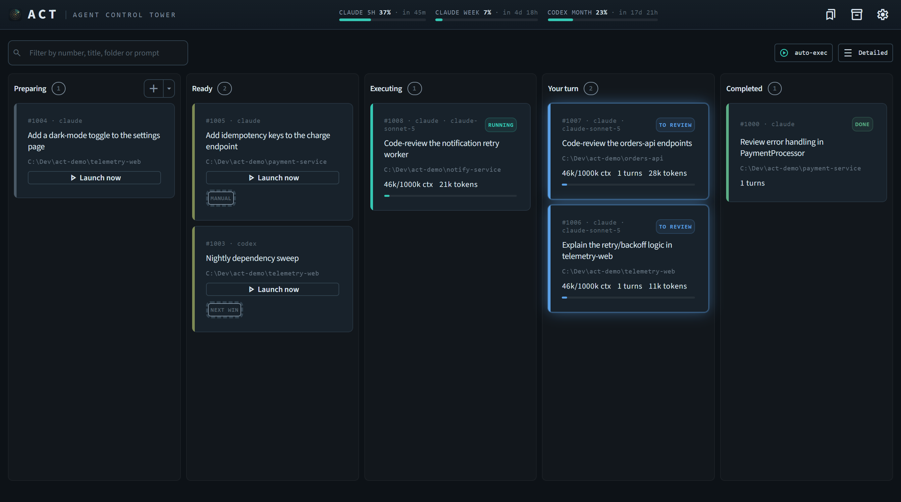
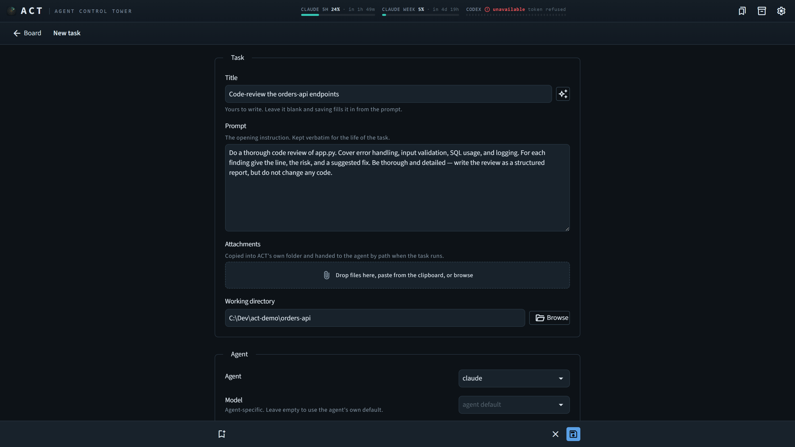
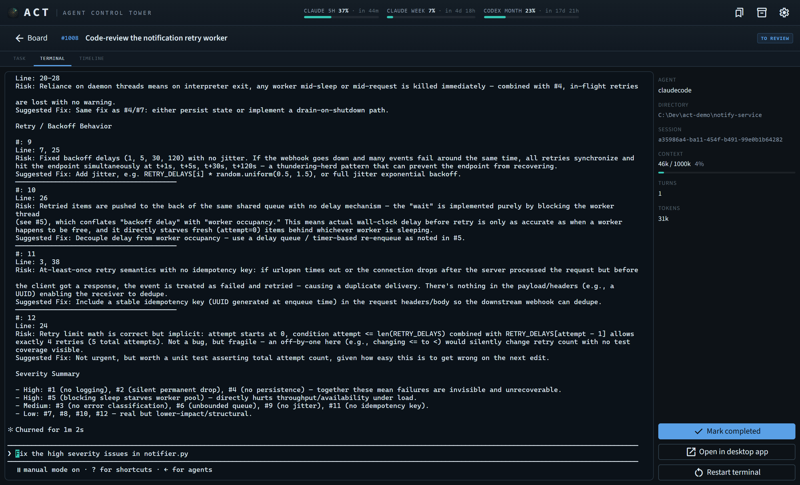
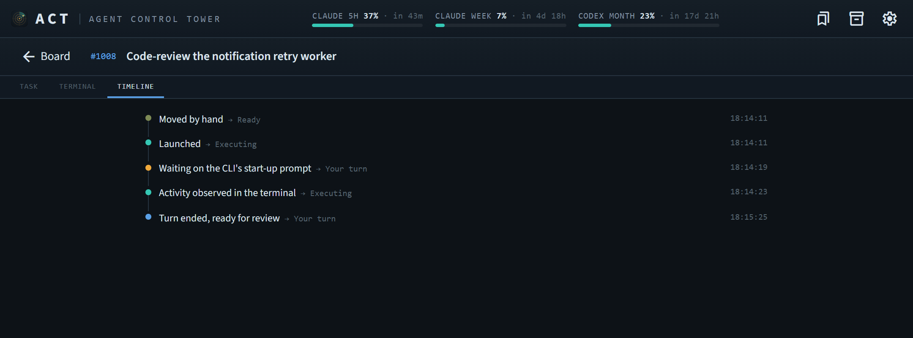

# ACT — Agent Control Tower

**One board for every coding-agent session on your machine.**

See all your Claude Code and Codex sessions at a glance, know instantly which
one needs you, and stage tasks in advance — scheduled to launch when a usage
window opens, so none of it goes to waste.

---

## Why ACT exists

Coding agents made it cheap to run multiple tasks at once — and expensive to keep
track of them. Each session lives in its own terminal, and none of them tells
you what the others are doing. The result is a familiar set of problems:

- **You can't see who needs you.** One agent is waiting on a permission prompt,
  another asked a question twenty minutes ago, a third is waiting for your review — and all three
  look like idle terminal tabs until you alt-tab through every one of them.
- **A waiting session is wasted time.** An agent parked on a question sits
  idle until you notice it.
- **Usage windows go to waste.** A token window resets with nothing queued to
  use it, because there is nowhere to stage work in advance — ACT lets you
  prepare tasks ahead and schedules their launch for when your usage window
  becomes available.

ACT is the control tower for that traffic. Every task is a card on a Kanban
board — styled as an air-traffic **flight strip** — that moves itself through
*Preparing → Ready → Executing → Your turn → Completed* as the session runs. A
badge on each card says exactly why it is where it is: `running`,
`needs permission`, `needs answer`, `error`, `to review`. One glance separates
"something is stuck" from "something is done", without reading a word.

The name doubles as the verb *to act*: the tool's whole job is helping you
decide which session needs attention — and act on it.

## Features

- **A live board, not a process list.** Cards move themselves as the session
  runs, driven by the agent's own lifecycle events. Amber blinks for a blocked
  prompt, red for an error, calm blue for work awaiting your review.
- **The real terminal, embedded.** ACT hosts each agent's actual interactive
  TUI — answer a permission prompt, reply to a question, or steer the session
  without leaving the board.
- **Prepare now, run later.** The board lets you draft and stage as many tasks
  as you want without executing anything right away — launch them yourself, or
  hand them to the scheduler.
- **Scheduling that knows your usage limits.** Queue tasks for *now*, *the next
  5-hour window*, or a specific time. The runner watches your live usage and
  holds the queue when a window is nearly spent, so tasks launch when your
  token window becomes available instead of dying mid-run.
- **Native OS notifications.** When you're not watching the board, the toast is
  the "needs you" signal — a blocked prompt, a finished task, a usage limit
  reached. Clicking it drops you straight into that card's terminal.
- **Task templates.** Save a recurring shape of work — "bugfix on repo X,
  Codex, accept-edits" — with its prompt skeleton and launch config, and create
  tasks from it in one click.
- **Follow-up tasks.** Agents can spawn follow-up tasks onto the board (a plan
  decomposing into implementation steps, a review handing off its leftovers),
  with lineage and dependency ordering — and you still gate every launch.
- **Attachments.** Hand a task screenshots, logs, or specs alongside its
  prompt; the agent reads them right off your disk.
- **A full account of every task.** Immutable original prompt, a timeline of
  every transition, and live metrics: tokens in/out, context usage,
  compactions, turns, tool calls.
- **Local-first.** Everything runs on your machine — a single embedded
  database file, no server, no account, no telemetry.

## Screenshots

*The board — every session, its state, and whose turn it is:*

*Creating a task — prompt, agent, model, permissions, and schedule in one form:*

*Inside a task — the agent's real terminal, hosted by ACT:*

*Every card keeps its full timeline — every launch, block, and hand-back:*

## Supported agents

- **Claude Code**
- **Codex**

Each agent plugs in through an adapter that normalizes its events into one
model, so ACT is open to supporting other agents in the future.

## Supported platforms

**Windows** and **Linux**, in a browser or as a desktop app. macOS is not
supported yet, but the stack is portable and it is open for the future.

## Getting started

Download the installer for your platform from the
[Releases](https://github.com/north-lab-kev/agent-control-tower/releases) page,
run it, and ACT opens as a desktop app. You'll need at least one supported
agent CLI installed and signed in — ACT finds it on its own.

To build and run from source instead, see
[docs/development.md](docs/development.md).

## Documentation

- [docs/overview.md](docs/overview.md) — the full specification: state model,
  data model, scheduling, notifications, UI direction.

## Contributing

ACT is **not accepting external contributions right now** — see
[CONTRIBUTING.md](CONTRIBUTING.md). Bug reports and issues are welcome.

## License

**Functional Source License (FSL)** — source-available. Anyone may read, use,
modify, and redistribute the code; only competing commercial use is prohibited.
Each release auto-converts to **Apache 2.0 after two years**. See
[LICENSE.md](LICENSE.md). *Not legal advice.*
